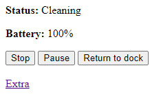
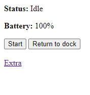
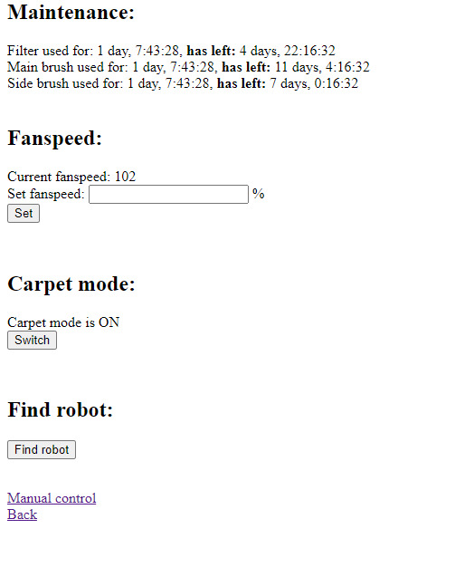
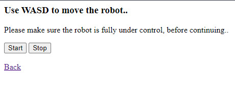

# MiioWeb

A web app to control robotic vacuum cleaners through the [python-miio](https://github.com/rytilahti/python-miio/) module.

**Screenshots:**

Main controls

 

**Extra controls**

**Manual (WASD) Controls**

